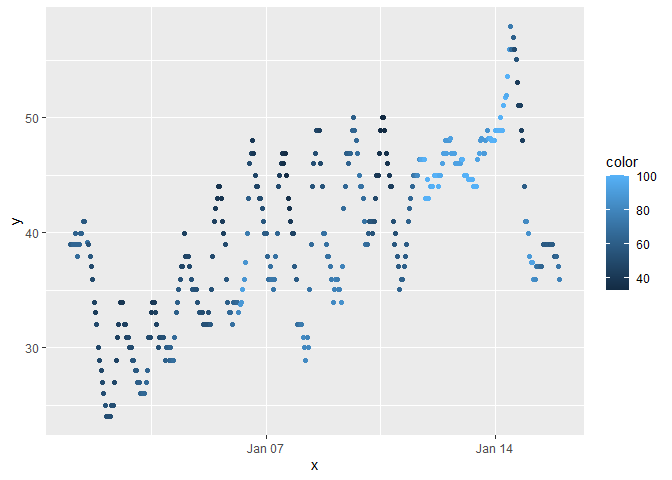

p8105_hw1_qra2000
================
2023-09-18

## Problem 1

The code chunk below loads the necessary libraries: `moderndive`
library, the `tidyverse` library, snd the `early_january_weather`
dataset.

``` r
library(moderndive)
library(tidyverse)
```

    ## ── Attaching core tidyverse packages ──────────────────────── tidyverse 2.0.0 ──
    ## ✔ dplyr     1.1.3     ✔ readr     2.1.4
    ## ✔ forcats   1.0.0     ✔ stringr   1.5.0
    ## ✔ ggplot2   3.4.3     ✔ tibble    3.2.1
    ## ✔ lubridate 1.9.2     ✔ tidyr     1.3.0
    ## ✔ purrr     1.0.2     
    ## ── Conflicts ────────────────────────────────────────── tidyverse_conflicts() ──
    ## ✖ dplyr::filter() masks stats::filter()
    ## ✖ dplyr::lag()    masks stats::lag()
    ## ℹ Use the conflicted package (<http://conflicted.r-lib.org/>) to force all conflicts to become errors

``` r
data("early_january_weather")
```

The next code chunk describes the `early_january_weather` dataset using
the following variables:

- the size of the dataset (using nrow and ncol)

- the mean temperature

- the variables in this dataset, including names / values of important
  variables

Size of the dataset (using nrow and ncol):

``` r
early_january_weather
```

    ## # A tibble: 358 × 15
    ##    origin  year month   day  hour  temp  dewp humid wind_dir wind_speed
    ##    <chr>  <int> <int> <int> <int> <dbl> <dbl> <dbl>    <dbl>      <dbl>
    ##  1 EWR     2013     1     1     1  39.0  26.1  59.4      270      10.4 
    ##  2 EWR     2013     1     1     2  39.0  27.0  61.6      250       8.06
    ##  3 EWR     2013     1     1     3  39.0  28.0  64.4      240      11.5 
    ##  4 EWR     2013     1     1     4  39.9  28.0  62.2      250      12.7 
    ##  5 EWR     2013     1     1     5  39.0  28.0  64.4      260      12.7 
    ##  6 EWR     2013     1     1     6  37.9  28.0  67.2      240      11.5 
    ##  7 EWR     2013     1     1     7  39.0  28.0  64.4      240      15.0 
    ##  8 EWR     2013     1     1     8  39.9  28.0  62.2      250      10.4 
    ##  9 EWR     2013     1     1     9  39.9  28.0  62.2      260      15.0 
    ## 10 EWR     2013     1     1    10  41    28.0  59.6      260      13.8 
    ## # ℹ 348 more rows
    ## # ℹ 5 more variables: wind_gust <dbl>, precip <dbl>, pressure <dbl>,
    ## #   visib <dbl>, time_hour <dttm>

``` r
nrow(early_january_weather)
```

    ## [1] 358

``` r
ncol(early_january_weather)
```

    ## [1] 15

The mean temperature:

``` r
temp <- early_january_weather$temp

mean(temp)
```

    ## [1] 39.58212

The variables in this dataset, including names/values of important
variables:

``` r
class(early_january_weather)
```

    ## [1] "tbl_df"     "tbl"        "data.frame"

``` r
str(early_january_weather)
```

    ## tibble [358 × 15] (S3: tbl_df/tbl/data.frame)
    ##  $ origin    : chr [1:358] "EWR" "EWR" "EWR" "EWR" ...
    ##  $ year      : int [1:358] 2013 2013 2013 2013 2013 2013 2013 2013 2013 2013 ...
    ##  $ month     : int [1:358] 1 1 1 1 1 1 1 1 1 1 ...
    ##  $ day       : int [1:358] 1 1 1 1 1 1 1 1 1 1 ...
    ##  $ hour      : int [1:358] 1 2 3 4 5 6 7 8 9 10 ...
    ##  $ temp      : num [1:358] 39 39 39 39.9 39 ...
    ##  $ dewp      : num [1:358] 26.1 27 28 28 28 ...
    ##  $ humid     : num [1:358] 59.4 61.6 64.4 62.2 64.4 ...
    ##  $ wind_dir  : num [1:358] 270 250 240 250 260 240 240 250 260 260 ...
    ##  $ wind_speed: num [1:358] 10.36 8.06 11.51 12.66 12.66 ...
    ##  $ wind_gust : num [1:358] NA NA NA NA NA NA NA NA NA NA ...
    ##  $ precip    : num [1:358] 0 0 0 0 0 0 0 0 0 0 ...
    ##  $ pressure  : num [1:358] 1012 1012 1012 1012 1012 ...
    ##  $ visib     : num [1:358] 10 10 10 10 10 10 10 10 10 10 ...
    ##  $ time_hour : POSIXct[1:358], format: "2013-01-01 01:00:00" "2013-01-01 02:00:00" ...

``` r
ls(early_january_weather)
```

    ##  [1] "day"        "dewp"       "hour"       "humid"      "month"     
    ##  [6] "origin"     "precip"     "pressure"   "temp"       "time_hour" 
    ## [11] "visib"      "wind_dir"   "wind_gust"  "wind_speed" "year"

The `early_january_weather` dataset shows the characteristics of weather
patterns for the Newark Liberty International Airport (EWK) in early
January 2013. The `early_january_weather` dataset is a 358 row x 15 row
tibble dataset. The mean temperature of the dataset is 39.58212. The
variables in this dataset are: `origin`, `year`, `month`, `day`, `hour`,
`temp`, `dewp`, `humid`, `wind_dir`, `wind_speed`, `wind_gust`,
`precip`, `pressure`, `visib`, and `time_hour`. Note, the `origin`
variable type is a character; `year`, `month`, `day`, and `hour` are
integers. `Temp`, `dewp`, `humid`, `wind_dir`, `wind_speed`,
`wind_gust`, `precip`, `pressure`, and `visib` are numerical values.
`time_hour` is a date/time format.

The next code chunk makes a scatterplot of `temp` (y) vs `time_hour`
(x), with color points using the `humid` variable:

``` r
problem1_df = 
  tibble(
    x = early_january_weather$time_hour,
    y = early_january_weather$temp,
    color = early_january_weather$humid,
)

ggplot(problem1_df, aes(x = x, y = y, color = color,)) + geom_point()
```

<!-- -->

The scatterplot of temp (y) vs time_hour (x) indicates a positive
association between temperature (y) and time_hour (x) for weather in
early January 2013 around Newark Liberty International Airport (EWK).
Humidity is also indicated in this scatterplot, as light blue indicates
higher humidity and dark blue indicates lower humidity. In early
January, humidity starts at dark blue at lower humidity levels. As the
time by hour increases throughout the rest of January, the humidity
increases to light blue as the temperature increases as well.

The next code chunk exports the scatterplot to my project directory
using ggsave:

``` r
ggsave("hw1_scatter_plot.png", height = 4, width = 6)
```

## Problem 2

The code chunk below creates a dataframe comprised of a random sample of
size 10 from a standard normal distribution, a logical vector indicating
whether elements of the sample are greater than 0, a character vector of
length 10, and a factor vector of length 10, with 3 different factor
“levels”.

``` r
problem2_df = 
  tibble(
    samp = rnorm(10),
    samp_gt_0 = samp > 0)
    char_vec = c("a", "b", "c", "d", "e", "f", "g", "h", "i", "j")
    factor_vec = factor (c("low", "low", "low", "mod", "mod", "mod", "mod", "high", "high", "high"))
```

The code chunk below shows the mean of each variable in `problem2_df`.
Variables “samp” and “samp_gt_0” are numeric, and are able to print a
result. In comparison, “char_vec” and “factor_vec” are string variables,
and therefore are not able to print a result.

``` r
mean(problem2_df[["samp"]]) 
```

    ## [1] -0.3472354

``` r
mean(problem2_df[["samp_gt_0"]]) 
```

    ## [1] 0.4

``` r
mean(problem2_df[["char_vec"]]) 
```

    ## Warning in mean.default(problem2_df[["char_vec"]]): argument is not numeric or
    ## logical: returning NA

    ## [1] NA

``` r
mean(problem2_df[["factor_vec"]]) 
```

    ## Warning in mean.default(problem2_df[["factor_vec"]]): argument is not numeric
    ## or logical: returning NA

    ## [1] NA

The mean of the sample:

``` r
mean(pull(problem2_df, samp))
```

    ## [1] -0.3472354

The code chunk below applies the as.numeric function to the logical,
character, and factor variables. What happens, and why? Does this help
explain what happens when you try to take the mean?

``` r
a = as.numeric(problem2_df[["samp"]])

a

y = as.numeric(problem2_df[["char_vec"]])

y

z = as.numeric(factor_vec)

z
```

By converting the logical, character, and factor variables to numeric
vectors using the `as.numeric` function, this allows non-numeric vectors
to be interpreted as numbers.
